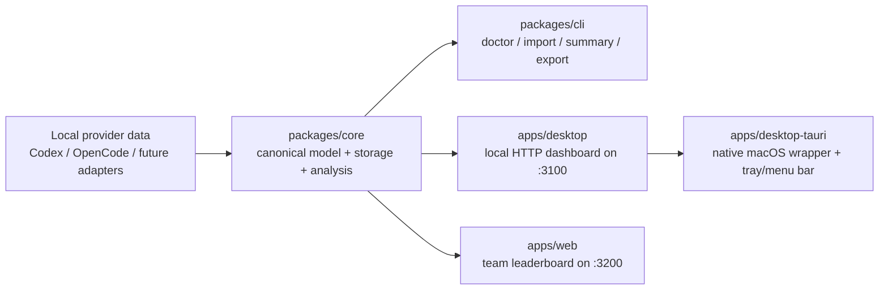

# Token Tracker

<p align="center">
  
</p>

<p align="center">
  Local-first intelligence for AI coding usage, spend, efficiency, and context pressure.
</p>

<p align="center">
  <a href="#quickstart">Quickstart</a> ·
  <a href="#desktop-and-menu-bar">Desktop</a> ·
  <a href="#repo-tour">Repo tour</a> ·
  <a href="#privacy-model">Privacy</a> ·
  <a href="#roadmap">Roadmap</a>
</p>

<p align="center">
  
  
  
  
  
</p>

---

## What this repo is

Token Tracker is a local-first product for understanding how AI coding tools are actually being used across your machine:

- how many tokens were consumed
- what that usage likely cost
- whether the sessions look productive or waste-heavy
- when context pressure is getting risky
- which provider is healthy, degraded, or missing reliable telemetry

It ships as a shared core plus three surfaces:

- a CLI for diagnosis and imports
- a desktop dashboard at `localhost:3100`
- a native macOS wrapper with tray/menu bar behavior

There is also a separate web surface for an opt-in team leaderboard at `localhost:3200`.

> Current truth: Codex and OpenCode are the validated local providers today. Cursor and Claude are intentionally called out as incomplete rather than hand-waved.

---

## Why it feels different

Most usage dashboards stop at token totals. This repo is trying to answer the more useful question:

**Was the spend worth it?**

That is why the product combines raw ingestion with:

- efficiency scoring
- waste and outcome classification
- success analysis
- context audit signals
- active-surface and menubar monitoring
- comparison snapshots against reference products

---

## Product surfaces

| Surface | What it does | Status |
|---|---|---|
| `packages/cli` | imports sessions, diagnoses providers, exports analytics, compares snapshots | working |
| `apps/desktop` | serves overview, analytics, session detail, menubar HTML, and export endpoints | working |
| `apps/desktop-tauri` | packages the local dashboard as a native macOS desktop/menu bar app | working |
| `apps/web` | hosts the private opt-in team leaderboard and GitHub-backed team settings | working |

### Core capabilities

| Capability | Notes |
|---|---|
| Local ingestion | Reads real local sources and stores normalized data in SQLite |
| Cost visibility | Shows provider and model cost distribution when pricing is available |
| Context audit | Tracks usage %, threshold band, and evidence-based warnings |
| Menubar monitoring | Compact tray/menu bar view with health cues and quick actions |
| Team leaderboard | Aggregated opt-in leaderboard with no raw prompts or transcripts |
| Export | JSON analytics bundle and SVG analytics summary card |

---

## Architecture at a glance



### The important separation

- `packages/core` is the product spine: adapters, canonical types, storage, pricing, analysis, analytics read models
- `apps/desktop` and `packages/cli` share the same local SQLite-backed data
- `apps/web` is isolated from the local desktop store and uses its own leaderboard database

That separation is one of the better decisions in the repo. It keeps the local product local, while still allowing a privacy-bounded team feature.

---

## Desktop and menu bar

The desktop experience is intentionally split into two layers:

1. a local web app for rich views
2. a native Tauri shell for ambient desktop behavior

### What the macOS wrapper gives you

- tray/menu bar entry
- compact menubar window
- dashboard window
- periodic spend polling for tray title updates
- active-window and notification plumbing
- native `.app` and `.dmg` packaging path

### Install file

You can generate a macOS installer image with:

```bash
npm run desktop:installer
```

Expected artifact:

```text
apps/desktop-tauri/src-tauri/target/release/bundle/dmg/Token Tracker_0.1.0_<arch>.dmg
```

### Desktop routes

| Route | Purpose |
|---|---|
| `/` | overview dashboard |
| `/?session=<id>` | session detail |
| `/analytics` | provider/model/daily analytics |
| `/menubar` | compact menu bar surface |
| `/api/summary` | summary JSON |
| `/api/analytics` | analytics JSON |
| `/export/analytics-svg` | downloadable SVG summary card |

---

## Quickstart

### 1. Install and build

```bash
npm install
npm run build
```

### 2. Inspect provider readiness

```bash
node packages/cli/dist/index.js doctor
node packages/cli/dist/index.js providers
```

### 3. Import local sessions

```bash
node packages/cli/dist/index.js import
```

### 4. Explore your data

```bash
node packages/cli/dist/index.js summary
node packages/cli/dist/index.js sessions --provider codex --limit 10
node packages/cli/dist/index.js analyze <session-id>
```

### 5. Open the desktop shell

```bash
node apps/desktop/dist/index.js
```

Then visit:

```text
http://localhost:3100/
http://localhost:3100/analytics
http://localhost:3100/menubar
```

### 6. Export analytics

```bash
node packages/cli/dist/index.js export
node packages/cli/dist/index.js export custom.json --days 7
```

### 7. Build the macOS app installer

```bash
npm run desktop:installer
```

---

## CLI commands

| Command | Description |
|---|---|
| `ttm doctor` | provider diagnostics and strategy status |
| `ttm providers` | known providers and support posture |
| `ttm import` | import sessions from available local sources |
| `ttm summary` | provider-level summary with pricing coverage |
| `ttm sessions` | recent session list with filters |
| `ttm analyze <id>` | detailed session analysis |
| `ttm export [path] [--days N]` | normalized analytics export |
| `ttm compare-snapshot ...` | compare against reference apps |

---

## Provider support

| Provider | Status | Notes |
|---|---|---|
| Codex | validated | reads `~/.codex/sessions/*.jsonl`, including rate-limit data used for true quota-backed reset meters |
| OpenCode | validated | reads `~/.local/share/opencode/opencode.db`; no quota truth is currently available |
| Cursor | strategy pending | local auth evidence exists, but no validated usage/quota/session API has been confirmed |
| Claude | unavailable | no validated local session source is currently wired |

For the Cursor investigation trail, start with [specs/002-productization/research.md](/Users/hanyramadan/token%20traker/specs/002-productization/research.md).

---

## Team leaderboard

The web app in `apps/web` is not a public SaaS clone of the desktop product. It is a constrained, private, opt-in leaderboard surface.

### What it includes

- GitHub connection status
- opt-in and opt-out controls
- team leaderboard by period
- leaderboard snapshot computation endpoint
- member ranking with aggregated metrics

### What it does not share

- raw prompts
- transcripts
- code content
- hidden admin overrides for visibility

Only aggregated efficiency and usage fields are copied into the leaderboard store.

---

## Privacy model

This repo is opinionated about keeping the sensitive parts local.

### Local-first by default

- local SQLite store at `.ttm/ttm.sqlite`
- desktop and CLI read from the same local store
- exports exclude raw prompts and raw transcripts
- leaderboard ingestion copies only aggregated fields

### Security posture already visible in code

- desktop HTTP responses set security headers
- API access can be protected with `TTM_DESKTOP_API_KEY`
- web auth uses an HttpOnly session cookie when GitHub OAuth is configured
- server-side validation exists around export paths and request handling

There is still hardening work to do, but the repo is already trying to make trustworthy behavior explicit.

---

## Repo tour

```text
apps/
  desktop/         local HTTP dashboard and menubar HTML
  desktop-tauri/   native macOS wrapper, tray, menu bar, installer path
  web/             opt-in leaderboard web app
packages/
  core/            adapters, domain model, SQLite, analytics, scoring
  cli/             terminal command surface
docs/
  architecture/    system boundaries and storage notes
  research/        investigation write-ups and phase research
  security-fixes/  hardening specs and implementation guidance
specs/
  001-013...       product slices, plans, tasks, quickstarts
```

### Best starting points

- [packages/core/src/index.ts](/Users/hanyramadan/token%20traker/packages/core/src/index.ts)
- [packages/cli/src/index.ts](/Users/hanyramadan/token%20traker/packages/cli/src/index.ts)
- [apps/desktop/src/index.ts](/Users/hanyramadan/token%20traker/apps/desktop/src/index.ts)
- [apps/desktop-tauri/src-tauri/src/lib.rs](/Users/hanyramadan/token%20traker/apps/desktop-tauri/src-tauri/src/lib.rs)
- [apps/web/src/index.ts](/Users/hanyramadan/token%20traker/apps/web/src/index.ts)

---

## Visual and UX direction

The product language in this repo is already fairly coherent:

- dark, dense, operator-facing surfaces
- mint-accent visual system
- strong emphasis on compact glanceability
- a menu bar surface that acts like a command center, not just a launcher

The README now mirrors that same direction by using the shared mobile logo to keep the brand system consistent across repos.

---

## Roadmap

- Cursor adapter once a trustworthy usage/session source is validated
- Claude ingestion once a real local source is confirmed
- more export surfaces beyond the analytics card
- richer leaderboard detail views
- optional cloud sync only after local behavior is well validated

---

## Documentation index

- [docs/project-handover.md](/Users/hanyramadan/token%20traker/docs/project-handover.md)
- [docs/architecture/local-sqlite-schema.md](/Users/hanyramadan/token%20traker/docs/architecture/local-sqlite-schema.md)
- [docs/security-status-2026-04-05-current.md](/Users/hanyramadan/token%20traker/docs/security-status-2026-04-05-current.md)
- [specs/002-productization/quickstart.md](/Users/hanyramadan/token%20traker/specs/002-productization/quickstart.md)
- [specs/007-rich-menubar-insights-and-command-center/spec.md](/Users/hanyramadan/token%20traker/specs/007-rich-menubar-insights-and-command-center/spec.md)
- [specs/012-window-scoped-context-notifications/spec.md](/Users/hanyramadan/token%20traker/specs/012-window-scoped-context-notifications/spec.md)

---

## A note on honesty

This repo is ambitious, but the useful thing is that it is also candid about what is real versus what is still under investigation. That makes it much more valuable than a polished dashboard that quietly invents certainty.
